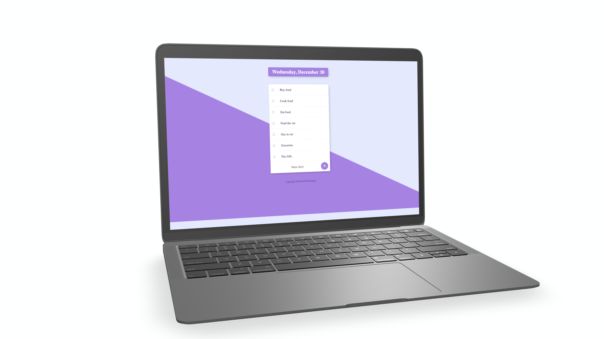

# To-Do List #
A To-Do list that makes it simple to cross out your accomplishments.
## Learned ##
* Use EJS to make HTML components
* Use EJS to add logic into HTML
* Add JS files to main Node.js file
* Use mongoDB to manage tasks
## Instructions to run ##
1. Install packages by running `npm install`
2. Run local server by entering `nodemon app.js` || `node app.js`
3. 3. Open `localhost:3000/`
## Different directories ##
* Today's tasks `localhost:3000/`
* Create a new seperate list `localhost:3000/{any-title}`
